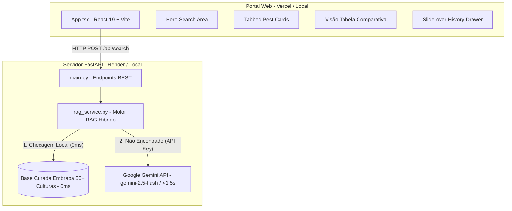

# 🏗️ Arquitetura Detalhada do Sistema — Radar Agrícola IA

> **Engenharia de Software Sênior**: Documentação de Arquitetura, Topologia e Limites de Componentes.  
> **Versão**: 2.3.0 Minimalist Cloud Ready  

---

## 📌 1. Topologia do Sistema Híbrido

O **Radar Agrícola IA** adota uma arquitetura desacoplada e resiliente, otimizada para alta disponibilidade e resposta instantânea em feiras de ciências e consultas agrícolas de campo.

---

## 🧱 2. Divisão de Responsabilidades dos Componentes

### 🎨 Frontend (`frontend/src/App.tsx`)
- **Gestão de Estado**:
  - `query`: Nome da cultura pesquisada.
  - `searchResult`: Dados estruturados da cultura e suas 4 pragas.
  - `viewMode`: Alternador entre `'cards'` (Cards com Abas) e `'table'` (Tabela Comparativa Agronômica).
  - `activeTabs`: Dicionário que rastreia a aba ativa (`'description'`, `'impact'`, `'control'`, `'implements'`) para cada card de praga individualmente.
  - `savedRecords`: Histórico mantido no `localStorage` do navegador com suporte a seleção múltipla e remoção em lote.

### 🐍 Backend (`backend/services/rag_service.py`)
- **Estruturas de Dados Pydantic**:
  - `PestInfo`: Define os campos da praga (`pestName`, `description`, `impactData`, `controlMethods`, `agriculturalImplements`, `sourceUrl`).
  - `CropAnalysisResult`: Contém `cropName` e `pests: List[PestInfo]`.
- **Hierarquia de Execução Fitossanitária**:
  1. **Base Curada Embrapa (0ms)**: Pesquisa case-insensitive e flexível em `AGRONOMIC_KNOWLEDGE_BASE`.
  2. **Chamada Direta Gemini**: Utiliza o SDK `google.genai` com prompt instruído para diagnóstico agronômico e recusa fitossanitária.
  3. **Sintetizador de Contingência**: Garante resposta sintética caso haja indisponibilidade total de rede.
